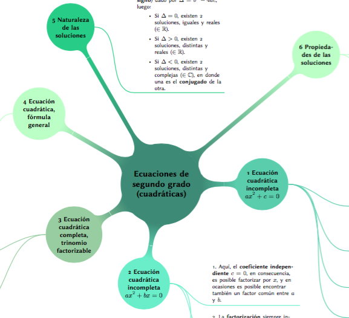

3MTP 2017
=========
Hans Sigrist <hsigrist@gmail.com>
2017-05-14
:appversion: 1.0.0
:description: Recursos, estrategias, notas de clase y material complementario de la asignatura Matemática, dirigido a estudiantes de Tercer año Enseñanza Media en régimen Técnico Profesional (TP).
:keywords: tercero medio, ecuación segundo grado, cuadrática, métodos de resolución, discriminante
:page-layout: docs
:page-description: {description}
:page-keywords: {keywords}
ifndef::env-site[]
:toc: left
:icons: font
:idprefix:
:idseparator: -
:sectanchors:
:source-highlighter: highlightjs
endif::[]
:experimental:
:mdash: &#8212;
:language: asciidoc
:source-language: {language}
:table-caption!:
:example-caption!:
:figure-caption!:
:imagesdir: ./images
:stem: latexmath
:lang: es
:stylesheet: ./stylesheets/mathbook.css

Recursos, estrategias, notas de clase y material complementario de la asignatura Matemática, dirigido a estudiantes de Tercer año Enseñanza Media en régimen Técnico Profesional (TP).

TIP: Este recurso pretende ser un recopilatorio de las actividades desarrolladas en clase. En ningún caso, corresponden a acciones que aseguren el aprendizaje, sin embargo, por su carácter asíncrono favorecen la lectura previa y posterior.

Esta guía se presenta, en *formato inverso*, es decir, se incluyen en primer lugar aquellas acciones que son las últimas. Tal como propone la planificación para este nivel, se desarrollan las unidades siguientes:

- Números imaginarios
- Ecuaciones de segundo grado
- Funciones cuadráticas

== Unidad 1 Números Complejos

=== Números imaginarios

=== Potencias de números imaginarios

=== Módulo y conjugado de un número complejo

=== Operatoria combinada con complejos

=== Suma y resta de complejos

=== Multiplicación

=== División

== Unidad 2 Ecuaciones de segundo grado

== Syllabus

Entre las *Metas de Aprendizaje* de la actual unidad se encuentran:

- Modelar situaciones o fenómenos cuyos modelos resultantes sean funciones cuadráticas.
- Comprender que toda ecuación de segundo grado con coeficientes reales tiene raíces en el conjunto de los números complejos.
- Formular conjeturas, verificar para casos particulares y demostrar proposiciones utilizando conceptos, propiedades o relaciones de los diversos temas tratados en el nivel, y utilizar heurísticas para resolver problemas combinando, modificando o generalizando estrategias conocidas, fomentando la actitud reflexiva y crítica en la resolución de problemas.
- Interesarse por conocer la realidad y utilizar el conocimiento.
- Comprender y valorar la perseverancia, el rigor y el cumplimiento, la flexibilidad y la originalidad.

== Ecuaciones cuadráticas
=== Panorama

=== Recursos

1. link:Guia_Formativa_2_3TP_Ecuacion_Segundo_Grado.pdf[Guia_Formativa_2_3TP_Ecuacion_Segundo_Grado.pdf]. Este material provee una serie de 90 ejercicios para apoyar su aprendizaje en los _métodos de resolución de ecuaciones de segundo grado_ propios de la *Unidad 2 Ecuaciones de segundo grado*.

2. link:Mapa_Mental_Unidad2_Ecuaciones_Cuadraticas.pdf[Mapa_Mental_Unidad2_Ecuaciones_Cuadraticas.pdf]. Mapa Mental de la unidad ecuaciones cuadráticas, refiérase a esta ficha para apreciar un *panorama de las principales características de este tipo de ecuaciones*.

=== Problema de apertura
Suponga que se desea cercar un terreno cuadrado cuya área conocida es de $552.25m^2$, al respecto:

- ¿Cuál es el perímetro del terreno?
- ¿Cómo obtiene la dimensión del lado del cuadrado?

Si ya reflexionó en torno a estas ideas, lo invito a observar el siguiente video que lo puede orientar más aún.

video::apertura.mov[width=600,options="nocontrols,autoplay"]

- ¿Por qué se desecha la solución latexmath:[x_2=-23.5]?
- ¿Por qué valor absoluto provee *dos soluciones*, una positiva y una negativa?

=== Ecuaciones incompletas de la forma latexmath:[ax^2+c=0]

Estas ecuaciones se caracterizan por la ausencia del término lineal, debido a que el *coeficiente lineal*, latexmath:[b=0].
En consecuencia, estas ecuaciones se resuelven mediante _despeje_ de la incógnita, a modo de ejemplo, observe la siguiente ecuación:

Lo anterior, permite establecer que toda ecuación de segundo grado de la forma latexmath:[ax^2+c=0], se puede resolver mediante un procedimiento similar al del ejemplo.

Para profundizar, puede observar el siguiente video:

.Example video
video::ecuacion-segundo-grado-incompleta-1.mov[width=800]

=== Ecuaciones incompletas de la forma latexmath:[ax^2+bx=0]

==== Ecuaciones cuadráticas trinomio factorizable de la forma latexmath:[ax^2+bx+c=0]
En este tipo de ecuaciones cuadráticas, están presentes todos los coeficientes, i.e., latexmath:[a,b,c], particularmente el caso en que latexmath:[a=1], de modo que es posible observar tan sólo los coeficientes lineal e independiente.

La estrategia consiste en *encontrar dos números que multiplicados den el valor de latexmath:[c] y los mismos números sumados den el valor de latexmath:[b].

=== Ecuaciones completas mediante fórmula general latexmath:[ax^2+bx+c=0]

La denominada *fórmula general*, permite resolver una ecuación de segundo grado en cualquiera de sus formas, es decir, es aplicable a ecuaciones: incompletas e incompletas, factorizables o no. Este hecho permite el hallazgo de soluciones de ecuaciones más complejas o con coeficientes numéricos menos tratables.

La mencionada fórmula es

\begin{equation*}
x=\frac{-b\pm\sqrt{b^2-4ac}}{2a}
\end{equation*}

WARNING: Se debe tener especial cuidado con *la extracción de los coeficientes latexmath:[a,b] y latexmath:[c], y su posterior reemplazo en la anterior fórmula. Entre los *errores frecuentes*, se observan:
- El caso en que latexmath:[a<0] no es correctamente reemplazado en la fórmula. No se considera correctamente su signo y tan sólo se considera el signo negativo de la fórmula y no el de latemath:[a].
- El caso en que latxmath:[c<0], idem anterior.
- El caso en que latxmath:[b<0], idem anterior, a pesar que dentro del radical da lo mismo -puesto que está al cuadrado- afuera debe multiplicarse el signo de latexmath:[b] por el signo negativo de la fórmula.
- El caso en que latexmath:[a<0], afecta finalmente a todos los sumandos del numerador.

== Análisis del discriminante

=== Aplicaciones a problemas no rutinarios, complejos y no familiares (CUN)

=== Representación de la función cuadrática mediante tablas y gráficos, y algebráicamente
